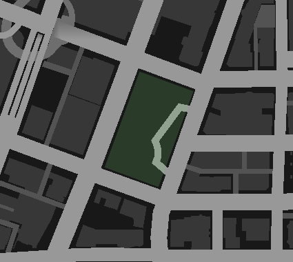

# GREEN ZONES

The term "Green zone" is often used to denote an area where you're safe. Literally like when kids play, and whomever is on *this* rock is "safe" and can't be "killed", or whatever.

A lot of RP servers employ this around their parking garages, or their car dealerships, or any number of other places.  
Most often just enforced by rules and after-the-fact penalties.

This resource was not made to replace this, but rather to make enforcement easier.

## Aiding external enforcement

Aiding external enforcement is twofold:

1) The resource outputs `[83] Yabrownies entered green zone "bobs_house"` when the player with that ID and name enters that green zone, and a corresponding message when they leave it.
2) The resource emits a client and server event at the same time, allowing other scripts to be "greenzone aware".

## Internal enforcement

If a zone has `enforce = true`, then some minor measures to make anyone in the zone harmless and immortal is made.  
See the [client script](client.lua), specifically the `SetZoneProtection` function, for exactly what it does.

**I fully expect this to clash with everyone's other scripts, which is why it's an opt-in option!**

# What is the intended use case?

This is basically just a very light weight version of a bunch of different polygonal zone scripts, such as my own [Paradise Area](https://github.com/DemmyDemon/paradise-area). Instead of needing a bunch of points to do something complex, it just needs very little information to do something simple.

The intended use case is to fire off events *to other scripts*, so they know that the player is in a zone where they are supposed to be harmless and unharmed, by blocking the equipping of weapons, for example.

As I see it, the biggest difference between this and something like Paradise Area, is that this is visible on the map. The simplistic shape of the area means very basic blips can be used to draw it.  This conveys the information to the players in a very easily recognizable way.

The [math involved](maff.lua) in rotating rectangles is fairly simple, so rotated rectangles are allowed.

For example, this is the Legion Park Green Zone:  


I also hope that this is a useful reference implementation of checking if someone is inside or outside an n-sided polygon.  
The `IsInsideZone` function in [maff.lua](maff.lua) will only ever check a rectangle *in this resource*, but the general concept can be used to check any polygon with reasonable accuracy.

# How do I set this up?

In [zones.lua](zones.lua), you can configure what zones you want, like so:

```lua
ZONES = {
    legion_park = {
        label = "Legion Park Green Zone",
        enforce = true,
        center = vec2(198, -932),
        width = 90.0,
        height = 160.0,
        rotation = -20,
    },
    la_puerta_helipad = {
        label = "~b~La Puerta Helipad",
        enforce = true,
        center = vec2(-733.5,-1454.5),
        radius = 50.0,
    },
}
```

The format is `name = data` where `data` is a table with any of the following:

| key     | example | type | function |
|---------|---------|------|----------|
| label   | "Bob's house" | string | What is shown on the bottom of the screen while in the zone. Omit to show nothing.
| enforce | true | boolean | When true, some minor effort is made to make anyone inside the zone harmless and unharmed.
| center  | vec2(0,0) | vector2 | **REQUIRED!** Where the center of the zone is located.
| width   | 18.7 | number | How wide, on the map, you want a rectangle zone to be.
| height  | 117.6 | number | How tall, on the map, you want a rectangle zone to be.
| rotation | 45.3 | number | How many degrees you want a rectangle zone to be rotated.


